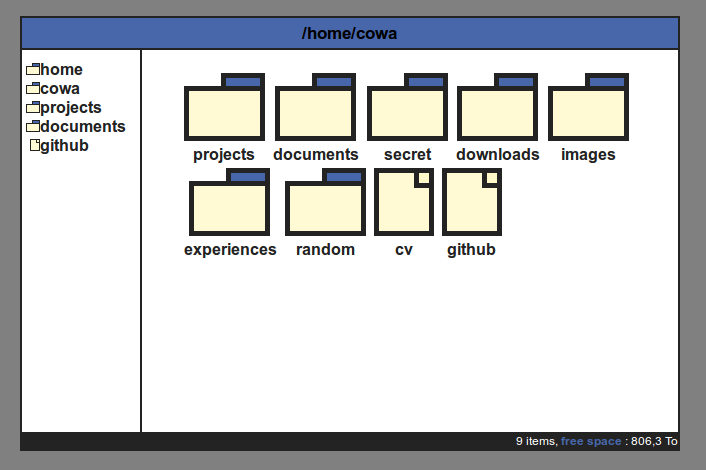
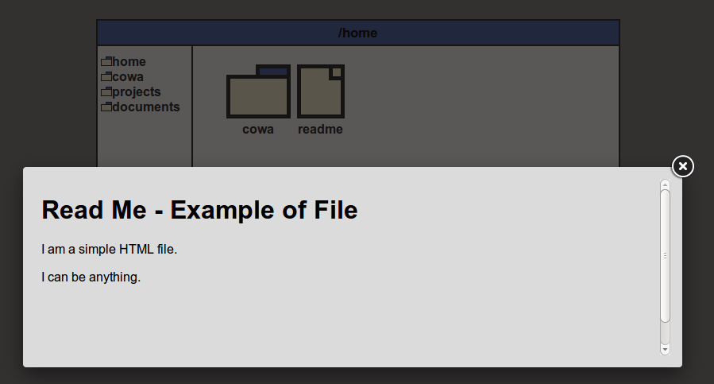
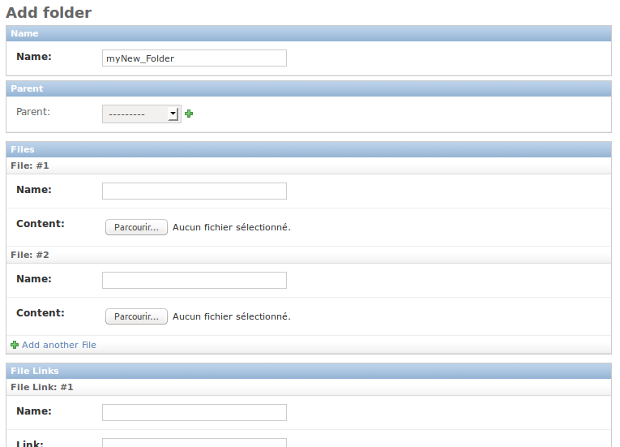

Django-FileManager
==================
**Progress: 100%**

A (very) tiny, kind of CMS to create your own personnal site with a file manager behavior

Written in Python by Brice Thomas, 2014

A quick look
------------
The default CSS is designed to be as simple as possible and flexible

Very easy to customize but a basic CSS knowledge is required

